# Proactive-Response — Concept Graph

An Obsidian-native map of the **when-to-speak** design space for streaming video LLMs.
Every node is one paper; nodes are grouped into the five idea-families (the same
grouping used by the sibling artifacts [[proactive-response-design-axes]],
[[proactive-response-benchmark-table]], and [[evolution-of-proactive-response]]).
Edges are **typed** and drawn from each note's own connection data — the
**cross-family** edges (a training-free trigger *beating* a learned head, an
offline model *adapting* into a streaming one) are the interesting ones. Two dotted
**gateway** edges reach out to the sibling sub-topics [[streaming-memory]] and
[[streaming-benchmarks]].

The seed of the whole field is [[videollm-online]] (LIVE, CVPR 2024): its per-frame
streaming-EOS loss is what every later family either **extends**, **replaces with a
head**, **rejects for a training-free gate**, or **adapts** onto a frozen model.

![[videollm-online.png]]
*The origin: [[videollm-online]]'s dual LM + streaming-EOS training layout — silence-vs-speak learned per frame.*

![[mmduet.png]]
*The pivot to dedicated heads: [[mmduet]] reframes the stream as a video-text **duet** and adds per-frame informative/relevance heads instead of one in-band token.*

## The graph

```mermaid
flowchart TD

  subgraph famA["A · In-band token gating (EOS / action tokens in the LM)"]
    videollm_online["VideoLLM-online (seed · EOS)"]
    stream_vlm_qevd["Stream-VLM / QEVD"]
    livecc["LiveCC"]
    proassist["ProAssist"]
    assistpda["AssistPDA"]
    lion_fs["LION-FS"]
    videollm_eyewo["VideoLLM-EyeWO"]
    streamo["Streamo (3-state token)"]
    thinkstream["ThinkStream"]
    mmduet2["MMDuet2 (RL on duet)"]
  end

  subgraph famB["B · Dedicated decision heads / trigger policies"]
    mmduet["MMDuet"]
    dispider["Dispider"]
    egospeak["EgoSpeak"]
    streammind["StreamMind"]
    vispeak["ViSpeak"]
    roma["ROMA"]
    proact_vl["Proact-VL"]
    streamready["StreamReady"]
    stride["STRIDE"]
    streamagent["StreamAgent"]
    sdqes["SDQES (task formalization)"]
  end

  subgraph famC["C · Training-free / decoding-time triggers"]
    livestar["LiveStar (SVeD PPL gate)"]
    livestarpro["LiveStarPro"]
    lyrav_dont_pause["LyraV (FSM controller)"]
    em_garde["Em-Garde (propose-match)"]
    response_g1["Response-G1 (scene-graph)"]
    timechat_online["TimeChat-Online (visual-change)"]
    querystream["QueryStream (relevance)"]
  end

  subgraph famD["D · Offline-to-streaming adaptation"]
    streambridge["StreamBridge"]
    evostreaming["EvoStreaming"]
    wat["WAT"]
  end

  subgraph famE["E · Agentic / interaction infrastructure"]
    streamov["StreamOV"]
    r3_streaming["R3-Streaming"]
    streamchat_nvidia["StreamChat (NVIDIA)"]
    streampro["StreamPro"]
  end

  subgraph gateway["Gateway — sibling sub-topics"]
    streaming_memory["streaming-memory (sub-topic)"]
    streaming_benchmarks["streaming-benchmarks (sub-topic)"]
  end

  %% --- Family A: extend / build on the EOS seed ---
  stream_vlm_qevd -->|"contemporary-of"| videollm_online
  livecc -->|"extends EOS-timing"| videollm_online
  proassist -->|"builds-on"| videollm_online
  assistpda -->|"streaming-EOS-base"| videollm_online
  lion_fs -->|"extends LIVE-loss"| videollm_online
  videollm_eyewo -->|"extends (adds ask-high)"| videollm_online
  streamo -->|"generalizes EOS -> 3-state"| videollm_online
  thinkstream -->|"inherits when-to-speak"| videollm_online
  mmduet2 -->|"RL-on / removes threshold"| mmduet

  %% --- Family B: replace the token with a head ---
  mmduet -->|"replaces-token-with-head"| videollm_online
  dispider -->|"disentangles decision/reaction"| videollm_online
  streammind -->|"beats-per-frame-LLM"| videollm_online
  roma -->|"speak-head-vs"| videollm_online
  vispeak -->|"informative-head-from"| mmduet
  proact_vl -->|"FLAG-head; fine-tunes"| livecc
  egospeak -->|"onset-primitive-for"| proassist
  sdqes -->|"formalizes onset-detection"| egospeak
  streamagent -->|"adds anticipation-vs"| dispider
  streamready -->|"readiness-gate-vs"| streambridge
  stride -->|"denoising-head-vs"| streambridge
  stride -->|"span-vs-pointwise critique"| mmduet

  %% --- Family C: training-free / decoding-time gates ---
  livestar -->|"rejects-EOS (PPL gate)"| videollm_online
  livestar -->|"beats"| mmduet
  livestarpro -->|"extends"| livestar
  lyrav_dont_pause -->|"FSM-wrapper-on (frozen)"| livestar
  em_garde -->|"training-free; beats"| mmduet2
  response_g1 -->|"scene-graph gate; beats"| streamagent
  timechat_online -->|"change-trigger-vs"| dispider
  querystream -->|"rejects change-heuristic"| timechat_online

  %% --- Family D: adapt an offline model into a stream ---
  streambridge -->|"adapts-offline"| videollm_online
  streamo -->|"replaces separate offline module"| streambridge
  evostreaming -->|"self-evolve; beats"| timechat_online
  wat -->|"watch-then-think-vs"| timechat_online

  %% --- Family E: agentic / infrastructure systems ---
  streamchat_nvidia -->|"per-decode refresh-vs"| videollm_online
  streamov -->|"omni trigger-head; beats"| roma
  r3_streaming -->|"reuses-DTD-operator"| timechat_online
  r3_streaming -->|"beats"| streamagent
  streampro -->|"reframes proactive-agency; beats"| mmduet2
  streampro -->|"beats"| streamo
  querystream -->|"relevance-trigger cf."| streamov

  %% --- Gateway edges to sibling sub-topics (dotted) ---
  livestarpro -.->|"memory-substrate-for (TSHM)"| streaming_memory
  streamready -.->|"memory-substrate-for (tree)"| streaming_memory
  streamagent -.->|"KV-cache memory"| streaming_memory
  sdqes -.->|"latency-aware eval"| streaming_benchmarks

  classDef seed fill:#ffe8cc,stroke:#e8890c,stroke-width:2px,color:#5a3600;
  classDef gate fill:#e6f0ff,stroke:#3b6fd4,stroke-width:2px,color:#12305e,stroke-dasharray:4 3;
  class videollm_online seed;
  class streaming_memory,streaming_benchmarks gate;
```

## Legend

**Node** = one paper (label = short name; id = slug with hyphens as underscores).
The orange **seed** node is [[videollm-online]]; the blue dashed **gateway** nodes are
the sibling sub-topics [[streaming-memory]] and [[streaming-benchmarks]], reached by
dotted edges.

**Edge types** (read *source → verb → target*):

| Edge label | Meaning | Example |
|---|---|---|
| `extends` / `builds-on` / `generalizes` | keeps the in-band token idea, adds capacity | [[streamo]] → [[videollm-online]] |
| `replaces-token-with-head` | swaps the LM's EOS token for a separate trigger head | [[mmduet]] → [[videollm-online]] |
| `rejects-EOS` / `training-free` gate | drops learned timing for a decoding-time signal | [[livestar]] → [[videollm-online]] |
| `rejects change-heuristic` | relevance-, not change-, conditioned trigger | [[querystream]] → [[timechat-online]] |
| `adapts-offline` | retrofits a frozen offline VideoLLM into a stream | [[streambridge]] → [[videollm-online]] |
| `RL-on` | replaces a hand-tuned threshold with an RL reward | [[mmduet2]] → [[mmduet]] |
| `beats` | reported win over the strongest baseline in that note | [[response-g1]] → [[streamagent]] |
| `span-vs-pointwise critique` | argues per-frame binary triggers are the wrong shape; span-structured decisions instead | [[stride]] → [[mmduet]] |
| `memory-substrate-for` (dotted) | gateway to the [[streaming-memory]] sub-topic | [[livestarpro]] ⇢ streaming-memory |
| `latency-aware eval` (dotted) | gateway to the [[streaming-benchmarks]] sub-topic | [[sdqes]] ⇢ streaming-benchmarks |

**Cross-family edges are the story.** Family C (training-free) papers repeatedly
*beat* family B heads ([[livestar]] over [[mmduet]]; [[em-garde]] over [[mmduet2]];
[[response-g1]] over [[streamagent]]) — evidence that a decoding-time signal can rival a
trained module. [[evostreaming]] sharpens the same point from the data side: ~1,000
*self-generated* trajectories (139× less than [[timechat-online]]'s ~139K curated
samples) lift FAR roughly 2–2.6× across backbones — undercutting the big-SFT programs
without any architecture change. Family D adapts the family-A seed onto frozen
backbones, and Family E (agentic) systems reuse family-C machinery ([[r3-streaming]]
borrows [[timechat-online]]'s Differential-Token-Drop operator) while pushing SOTA. The
convergence to watch: pruning/memory and triggering are merging —
[[querystream]] and [[streamov]] condition the trigger on **query-relevant evidence**,
which is why two gateway edges cross into [[streaming-memory]]. In fact the trigger
signal and the memory-salience signal are collapsing into **one scalar**:
[[livestarpro]] reuses its SVeD perplexity three ways (timing gate, Peak-End keyframe
salience, memory retrieval), [[timechat-online]]'s drop-ratio valleys both compress
tokens and fire the trigger, and cross-topic [[fluxmem]] reuses its TAS redundancy
scores as a zero-cost trigger. Nobody has tested whether importance-for-memory really
≡ importance-for-speaking — a compressible frame can still demand an alert.

**Read the `beats` edges with two caveats.** First, "OVO FAR" is not one metric:
[[em-garde]] re-scores it as an online recall/precision F1 (30.99 vs [[mmduet2]]'s
20.51), while [[response-g1]]'s 58.2 average is accuracy-style — the edges above are
each paper's own comparison, not rungs of a single ladder. Second, some wins ride the
backbone: [[streamov]]'s +22.5 over [[roma]] pairs a frozen Qwen3-Omni-30B against
roma's Qwen2.5-Omni, so method and scale are unseparated. And a single number hides
the failure mode: [[omni-duplexeval]] shows the field split into over-firing
(LiveCC-Base 91.1% wrong-fires) vs over-silence ([[mmduet2]] 75.8% no-answer) —
opposite errors, same-looking scores.

## Tensions the graph hides

Threads that cut *across* the family boxes and don't reduce to a single edge:

- **The class-imbalance lineage** — silence tokens swamp speak tokens, and at least six
  papers independently rediscover the same fix, each escalating the loss:
  [[videollm-online]] (plain CE) → [[streammind]] (weighted CE, silence weight ≈10P;
  imbalance 310:1 on Ego4D, 71:1 on Soccer) → [[roma]] (weighted BCE,
  $w_{pos}=N_{neg}/N_{pos}$) → [[proassist]] (negative-frame sub-sampling ρ=0.1,
  narration F1 30.1 → 58.7) → [[streamo]] (focal loss; OVO Forward-Active REC 27.94 vs
  6.45 plain CE) → [[streampro]] (effective-number class-balanced loss; SPB 6.6 CE <
  14.2 focal < 16.3 CB). In family A the load-bearing change is often the **loss, not
  the token**.
- **What to do with your own past outputs — three incompatible axioms.** [[mmduet]]
  *deletes* past assistant turns from context (kills repetition spam); [[dispider]]
  *quarantines* them (reaction tokens never re-enter the decision loop — its
  non-blocking invariant); [[thinkstream]] *keeps and relies on* them as compressed
  memory (RLVR CoT-as-memory 64.8 vs 56.9 without). No paper engages the others'
  position.
- **The unify ↔ decouple pendulum.** [[streamo]] claims one-pass unification beats
  [[streambridge]]'s separate decision module; [[stride]] simultaneously claims a
  modular span-denoising front-end beats a unified per-frame AR head by +27.1 TVG F1.
  Both cite accuracy and efficiency; the field oscillates on its central axis.
- **Magic thresholds, no calibration story.** Every trigger carries a fixed constant —
  τ=0.3 ([[proact-vl]]), ≈0.35 ([[streambridge]], [[streamready]]), α=1.03
  ([[livestar]]), θ=0.04 ([[em-garde]]) — yet [[streammind]]'s domain-dependent
  imbalance ratios say the operating point is domain-specific. Cross-domain threshold
  transfer is unstudied, and the obvious hybrid (family-C perplexity as a *feature*
  into a family-B learned head) is an unbuilt baseline.
- **The audio blind spot.** [[egospeak]] found audio-only ≥ audio+vision for onset
  prediction on Ego4D (mAP 69.2 vs 69.0), yet the trigger families are almost entirely
  vision-conditioned — only [[roma]], [[vispeak]], and [[streamov]] ingest audio at
  all. No dedicated audio-onset trigger exists in the LLM family.

## Appendix — every paper (for the Obsidian graph view)

Family A — in-band token gating:
- [[videollm-online]]
- [[stream-vlm-qevd]]
- [[livecc]]
- [[proassist]]
- [[assistpda]]
- [[lion-fs]]
- [[videollm-eyewo]]
- [[streamo]]
- [[thinkstream]]
- [[mmduet2]]

Family B — dedicated decision heads / trigger policies:
- [[mmduet]]
- [[dispider]]
- [[egospeak]]
- [[streammind]]
- [[vispeak]]
- [[roma]]
- [[proact-vl]]
- [[streamready]]
- [[stride]]
- [[streamagent]]
- [[sdqes]]

Family C — training-free / decoding-time triggers:
- [[livestar]]
- [[livestarpro]]
- [[lyrav-dont-pause]]
- [[em-garde]]
- [[response-g1]]
- [[timechat-online]]
- [[querystream]]

Family D — offline-to-streaming adaptation:
- [[streambridge]]
- [[evostreaming]]
- [[wat]]

Family E — agentic / interaction infrastructure:
- [[streamov]]
- [[r3-streaming]]
- [[streamchat-nvidia]]
- [[streampro]]

Sibling sub-topic anchors (gateways): [[streaming-memory]] · [[streaming-benchmarks]]

Related synthesis artifacts: [[evolution-of-proactive-response]] · [[proactive-response-design-axes]] · [[proactive-response-benchmark-table]] · hub [[proactive-response]]
