# Streaming Benchmarks — Concept Graph

A concept map of the 17 deep-analyzed streaming-video benchmarks, grouped by
**idea family** and wired with **typed lineage edges** drawn from each note's
`connects` data. The interesting edges are the **cross-family** ones (e.g. an
omni-modal benchmark extending a proactive-timing metric, or a model-owned-timing
protocol *re-scoring* an evaluator-timed benchmark). Six **gateway edges** (dashed,
green) reach out to the sibling sub-topic hubs [[streaming-memory]] and
[[proactive-response]], and three **seed edges** (dashed, gray) reach back to the 2024
precursors filed under proactive-response: [[videollm-online]] (the model whose 32.48
frames the gap), [[stream-vlm-qevd]] (the content+timing two-axis template — its ±3 s
Temporal F-Score is nearly [[omnipro]]'s ±3 s greedy F1, six benchmark-generations
later), and [[sdqes]] (SR@k, the earliest latency-aware streaming metric, whose
asymmetric window prefigures OVO's forward decay and river-bench's asymmetry).

Founding taxonomy (the root of most spines): [[streamingbench]] — offline QA vs
timestamped streaming QA over real-time / omni-source / contextual axes.

![[streamingbench.png]]
*Crux figure — StreamingBench's offline-vs-streaming timestamped 3-category schematic; the taxonomy nearly every later benchmark extends. Source [[streamingbench]].*

## The graph

```mermaid
flowchart TD
  subgraph A["A · Evaluator-timed streaming QA"]
    streamingbench["StreamingBench"]
    ovbench_videochat_online["OVBench / VideoChat-Online"]
    rtv_bench["RTV-Bench (MTQA)"]
    streamingcot["StreamingCoT"]
  end

  subgraph B["B · Temporal-regime benchmarks"]
    ovo_bench["OVO-Bench (back/real/fwd)"]
    streameqa["StreamEQA (embodied)"]
  end

  subgraph C["C · Interactive-dialogue benchmarks"]
    svbench["SVBench (dialogue chains)"]
    river_bench["RIVER-Bench"]
  end

  subgraph D["D · Proactive-timing + model-owned-timing"]
    proactivevideoqa["ProactiveVideoQA (PAUC)"]
    streamingeval["StreamingEval (StreamingScore)"]
    streamgaze["StreamGaze (gaze)"]
    egopro_bench["EgoPro-Bench (persona)"]
    streaming_video_wild["Streaming-in-the-Wild (SW-F1)"]
  end

  subgraph E["E · Omni-modal interaction benchmarks"]
    omnimmi["OmniMMI (M4)"]
    omnipro["OmniPro (probe/online)"]
    omni_duplexeval["Omni-DuplexEval"]
    omniinteract["OmniInteract (IA-QTF1)"]
  end

  subgraph S["2024 seeds (proactive-response)"]
    videollm_online["VideoLLM-Online"]
    stream_vlm_qevd["Stream-VLM / QEVD"]
    sdqes["SDQES (SR@k)"]
  end

  subgraph GW["Sibling sub-topics"]
    streaming_memory["streaming-memory"]
    proactive_response["proactive-response"]
  end

  %% --- Family A internal + spine from the root ---
  ovo_bench -->|extends| streamingbench
  svbench -->|extends| streamingbench
  ovbench_videochat_online -->|extends| streamingbench
  streamingcot -->|complements| streamingbench
  rtv_bench -->|evaluates VideoChat-Online| ovbench_videochat_online

  %% --- Family B ---
  streameqa -->|extends embodied×temporal| ovo_bench
  rtv_bench -->|contrasts same-query MTQA| ovo_bench

  %% --- Family C ---
  river_bench -->|refines taxonomy| ovo_bench
  river_bench -->|extends past/present/future| ovbench_videochat_online
  rtv_bench -->|related evolving-scene| svbench

  %% --- Family D (proactive/model-owned timing) ---
  proactivevideoqa -->|deepens proactive| streamingbench
  streamgaze -->|adds gaze| proactivevideoqa
  egopro_bench -->|adds personalization| proactivevideoqa
  streamgaze -->|contrasts| ovo_bench
  egopro_bench -->|shares embodied-ego| streameqa
  egopro_bench -->|re-evaluates| omnimmi
  streaming_video_wild -->|critiques correctness-only| streamingbench
  streaming_video_wild -->|extends to multi-turn| ovo_bench
  streamingeval -->|re-scores| streamingbench
  streamingeval -->|re-scores| ovo_bench

  %% --- Family E (omni-modal) ---
  omnimmi -->|extends omni-axis| streamingbench
  omni_duplexeval -->|extends| omnimmi
  omniinteract -->|extends| omnimmi
  omnipro -->|extends| omnimmi
  omniinteract -->|generalizes| ovo_bench
  omni_duplexeval -->|extends| proactivevideoqa
  omnipro -->|extends probe-online split| proactivevideoqa

  %% --- Cross-topic seed edges (2024 precursors) ---
  videollm_online -.->|model gap it frames| streamingbench
  stream_vlm_qevd -.->|content+timing template| proactivevideoqa
  sdqes -.->|earliest latency-aware metric| ovo_bench

  %% --- Gateway edges to sibling sub-topics ---
  ovbench_videochat_online -.->|memory-substrate-for| streaming_memory
  streamingeval -.->|re-scores memory models| streaming_memory
  proactivevideoqa -.->|operationalizes + trains| proactive_response
  streaming_video_wild -.->|benchmarks proactive VLMs| proactive_response
  river_bench -.->|forgetting curve unused| streaming_memory
  ovo_bench -.->|FAR = proactive scoreboard| proactive_response

  classDef gateway fill:#0b5,stroke:#083,color:#fff;
  class streaming_memory,proactive_response gateway;
  classDef seed fill:#888,stroke:#555,color:#fff;
  class videollm_online,stream_vlm_qevd,sdqes seed;

  linkStyle 27,28,29 stroke:#888,stroke-width:2px,stroke-dasharray:3 3;
  linkStyle 30,31,32,33,34,35 stroke:#0b5,stroke-width:2px,stroke-dasharray:5 4;
```

## Legend

**Node** = one benchmark note (id = slug, label = short name). **Subgraphs** = the
five idea families kept consistent across the sibling artifacts
([[evolution-of-streaming-benchmarks]], [[streaming-benchmarks-design-axes]],
[[streaming-benchmarks-benchmark-table]]).

**Edge types** (read as "source → target"):
- **extends** — inherits and enlarges the target's taxonomy/protocol (e.g. an omni or embodied axis bolted onto an existing benchmark).
- **refines-taxonomy** — reorganizes the same past/present/future axis more finely.
- **complements** — orthogonal supervision (e.g. spatiotemporal CoT traces) added alongside.
- **evaluates** — the source benchmark scores the target's *released model* (OVBench ships the VideoChat-Online model, which RTV-Bench then benchmarks).
- **re-evaluates / re-scores** — the source re-runs the target *benchmark* under a new, stricter protocol (unified proactive protocol, or a wall-clock/byte-budget harness).
- **critiques** — the source calls out a validity gap in the target (correctness-only, single-turn).
- **contrasts / generalizes / related** — weaker family or motivational links.
- **Green dashed** = gateway edges to sibling sub-topic hubs (memory substrate / proactive-response operationalization).
- **Gray dashed** = cross-topic seed edges from the 2024 precursor papers (filed under proactive-response) whose metrics/framings the benchmark family descends from.

**Cross-family edges are the load-bearing ones:** proactive-timing benchmarks
([[streamingeval]], [[egopro-bench]], [[streaming-video-wild]]) reach *back* into the
evaluator-timed and temporal-regime families to re-score or critique them — this is
the 2026 validity correction (model-owned timing vs. evaluator-supplied timestamps).
Omni-modal benchmarks ([[omni-duplexeval]], [[omnipro]]) reach into family D by
extending the proactive PAUC lineage of [[proactivevideoqa]].

**The re-scoring edges settle a real contradiction.** [[streamingbench]] found
purpose-built streaming models *worst* (VideoLLM-Online 32.48, Flash-VStream 24.04 vs
offline LLaVA-OneVision 56.36); [[rtv-bench]] found the opposite (online VITA-1.5
44.51 beats offline VideoLLaMA2 39.55). [[streamingeval]]'s wall-clock protocol shows
both are metric artifacts — the improved Flash-VStream variant *gains* accuracy (OVO
33.15 → 50.31) while its StreamingScore collapses (2.34 → 0.74, MaxFPS 8 → 1). Which
paradigm "wins" is decided by what the metric charges for; that is why the re-scores
edges exist.

## Beyond lineage — the benchmark→model feedback loop

The gateway edges hide a tighter coupling than "operationalizes": benchmarks in this
graph don't just *measure* the sibling sub-topics, they *train* and *diagnose* them.
- **Metric-as-reward**: [[proactivevideoqa]]'s PAUC is lifted wholesale into
  [[mmduet2]]'s multi-turn GRPO training reward (the dominant term, weight 3 of 4).
- **Benchmark-as-diagnosis**: ProactiveVideoQA's duplicate-turn audit exposed *why*
  proactive-trained models score low — [[mmduet]] emits 81–99% duplicate turns —
  directly motivating mmduet2's repetition-penalty reward term.
- **Metric-as-scoreboard**: [[ovo-bench]]'s FAR became the de-facto objective the
  proactive-response sub-topic optimizes ([[em-garde]], [[response-g1]],
  [[evostreaming]], [[streampro]] all report and target it).
- **Model-as-infrastructure**: [[streamgaze]] fine-tunes [[vispeak]] as its strongest
  streaming baseline — a proactive-response model consumed as benchmark plumbing.

## Structural gaps the graph exposes

- **The co-ship pattern**: 7 of 17 papers ship a companion model
  ([[omnimmi]]→M4, [[svbench]]→StreamingChat, [[ovbench-videochat-online]]→VideoChat-Online,
  [[river-bench]]→LTM adapter, [[egopro-bench]]→ProAct-Stream, [[streaming-video-wild]]→harness,
  [[streamgaze]]→AssistGaze), and co-shipped models post the strong own-benchmark
  numbers, while pure benchmarks consistently report large unsolved gaps. This split
  explains the ~70-point disagreement on "is proactive timing solved": own-model
  ProAct-Stream F1 91.19 vs third-party proactive scores of 20.0 ([[omni-duplexeval]],
  human-duplex 92.8) and 25.50 ([[omnimmi]] PA). Discount co-shipped headline numbers.
- **An unclaimed enables edge**: [[river-bench]] is the only benchmark measuring the
  exact quantity memory papers optimize — an explicit forgetting curve over four
  recall-interval buckets — yet no [[streaming-memory]] paper reports on it; all proxy
  with OVO/StreamingBench accuracy. Its gray gateway edge marks a wiring failure.
- **The validity axes never intersect**: wall-clock compute ([[streamingeval]]),
  duplex multi-turn ([[omni-duplexeval]]), omni-audio dependence ([[omnipro]]), and
  in-the-wild scale ([[streaming-video-wild]]) each exists exactly once; every
  pairwise combination is empty.
- **Resumption is measured once and is broken**: [[omniinteract]]'s nested-query
  protocol is the only probe of interruption→resumption — Gemini answers the inner
  query but fails to resume the outer in 119/120 cases (NCCS 0.001). No other
  benchmark tests it; no model trains for it.
- **Human baselines don't transfer across nodes**: only [[omni-duplexeval]] measures
  humans *under the streaming constraint* (offline 91.5 → duplex 81.8) — every
  human–model gap computed against an offline human overstates the reachable ceiling.

## Appendix — every paper (for Obsidian graph view)

Family A — evaluator-timed streaming QA:
- [[streamingbench]]
- [[ovbench-videochat-online]]
- [[rtv-bench]]
- [[streamingcot]]

Family B — temporal-regime benchmarks:
- [[ovo-bench]]
- [[streameqa]]

Family C — interactive-dialogue benchmarks:
- [[svbench]]
- [[river-bench]]

Family D — proactive-timing + model-owned-timing protocols:
- [[proactivevideoqa]]
- [[streamingeval]]
- [[streamgaze]]
- [[egopro-bench]]
- [[streaming-video-wild]]

Family E — omni-modal interaction benchmarks:
- [[omnimmi]]
- [[omnipro]]
- [[omni-duplexeval]]
- [[omniinteract]]

Cross-topic seeds (2024 precursors, filed under proactive-response):
- [[videollm-online]]
- [[stream-vlm-qevd]]
- [[sdqes]]

Sibling sub-topic hubs (gateways):
- [[streaming-memory]]
- [[proactive-response]]
- [[streaming-benchmarks]] (this hub)

Sibling synthesis artifacts:
- [[evolution-of-streaming-benchmarks]]
- [[streaming-benchmarks-design-axes]]
- [[streaming-benchmarks-benchmark-table]]
