# Streaming-Memory Concept Graph

A typed dependency map of the 37 deep notes in **[[streaming-memory]]**. Every node is one
paper; edges are the *relationships* the notes record (extends / beats / training-free-variant /
contrasts / stacks-on / …), and the interesting ones are the **cross-family** edges that show how
the KV-retrieval line, the compression line, and the trained-memory line keep borrowing from each
other. Two roots anchor the field: **[[rekv]]** (store-all KV + query-time retrieval) and
**[[flash-vstream]]** (bounded compressed memory read on demand); almost everything is a descendant,
variant, or rival of one of these two, with **[[streamingdvc]]** as the CVPR-2024 clustering-memory
ancestor upstream of the whole compressed-memory branch. [[streamingdvc]] is in fact *doubly*
ancestral: besides the K-means memory that [[flash-vstream]] extends, its trick of feeding earlier
captions back as a text prefix — "language retains what the bounded memory has forgotten" — is the
earliest memory-as-language instance, and the text-substrate line ([[providellm]]'s verbalized
visual memory, [[vst]]/[[tww]]'s thoughts-and-notes-as-memory) descends from that second idea.

The two ancestral roots, side by side — retrieve-everything vs. bound-and-compress:

```mermaid
flowchart TD
    subgraph famC["C · KV / segment retrieval"]
        rekv["ReKV (root: store-all + retrieve)"]
        livevlm["LiveVLM"]
        streamkv["StreamKV"]
        cacheflow["CacheFlow"]
        rlivs["rLiVS"]
        v_rex["V-Rex"]
    end

    subgraph famA["A · Budgeted KV compression / eviction"]
        infinipot_v["InfiniPot-V"]
        streammem["StreamMem"]
        streamingtom["StreamingTOM"]
        streamingassistant["StreamingAssistant"]
        decouple_and_cache["DSCache"]
        omnimem["OmniMem (audio-visual)"]
    end

    subgraph famB["B · Streaming attention layouts (sink + window; think-while-stream)"]
        streamingvlm["StreamingVLM"]
        tays["TaYS"]
        vst["VST"]
    end

    subgraph famD["D · Hierarchical / event-structured / parametric memory"]
        flash_vstream["Flash-VStream (root: bounded memory)"]
        streamingdvc["Streaming-DVC (ancestor)"]
        videostreaming["VideoStreaming"]
        videollamb["VideoLLaMB"]
        streamchat_mem["StreamChat"]
        videoscan["VideoScan"]
        providellm["ProVideLLM"]
        ovg_hq_unify["OVG-HQ (parametric)"]
        videoscaffold["VideoScaffold"]
        eventmemagent["EventMemAgent"]
        fluxmem["FluxMem"]
        tww["TWW (watch-while-think)"]
        weavetime["WeaveTime"]
        streamforest["StreamForest"]
        hermes_kv["HERMES"]
        video_salmonn_s["video-SALMONN-S (parametric TTT)"]
    end

    subgraph famE["E · Agentic / semantic memory"]
        visual_agentic_memory["VAM"]
        streammeco["StreamMeCo"]
        savemem["SAVEMem"]
        cogreasoner["CogReasoner"]
        streamvln["StreamVLN (embodied)"]
    end

    subgraph famF["F · Principled selection (what to remember at all)"]
        streaming_model_remember["SelectStream"]
    end

    subgraph sib["Sibling sub-topics (gateway)"]
        streaming_benchmarks["streaming-benchmarks"]
        proactive_response["proactive-response"]
    end

    %% two-root contrast
    rekv -.->|contrasting branch| flash_vstream

    %% Family C -> roots
    cacheflow -->|extends| rekv
    cacheflow -->|training-free sibling| infinipot_v
    streamkv -->|extends| rekv
    streamkv -->|sibling| infinipot_v
    livevlm -->|no-offload variant of| rekv
    livevlm -->|query-agnostic sibling| infinipot_v
    rlivs -->|extends| rekv
    rlivs -->|training-free variant of| videostreaming
    rlivs -->|beats| flash_vstream
    v_rex -->|adaptive-threshold extends| rekv
    v_rex -->|sibling| hermes_kv
    v_rex -->|defends offload against| infinipot_v

    %% Family A
    infinipot_v -->|compresses-not-offloads| rekv
    streammem -->|query-agnostic variant of| rekv
    streammem -->|fixes FIFO forgetting of| livevlm
    streamingtom -->|extends| streammem
    streamingtom -->|retrieval predecessor| rekv
    streamingassistant -->|adjacent| streamkv
    streamingassistant -->|efficiency sibling| streamingvlm
    decouple_and_cache -->|fixes recency bias of| streamingvlm
    decouple_and_cache -->|composes-with / beats| rekv
    decouple_and_cache -->|stacks on| infinipot_v
    omnimem -->|extends| streammem
    omnimem -->|beats| hermes_kv
    omnimem -->|audio-visual backbone| video_salmonn_s

    %% Family B
    streamingvlm -->|training-aligned variant of| rekv
    tays -->|extends| decouple_and_cache
    tays -->|KV-mgmt extends| streamingvlm
    vst -->|overtakes| streamforest
    vst -->|textual-memory contrast| flash_vstream

    %% Family D
    flash_vstream -->|extends| streamingdvc
    streamforest -->|extends| flash_vstream
    streamforest -->|compressed-KV predecessor| rekv
    hermes_kv -->|displaces| rekv
    hermes_kv -->|improves| streammem
    hermes_kv -->|beats| livevlm
    fluxmem -->|hierarchical extends| flash_vstream
    fluxmem -->|sibling| streammem
    videostreaming -->|contemporaneous| flash_vstream
    videollamb -->|sibling recurrent memory| videostreaming
    videollamb -->|contemporaneous| flash_vstream
    streamchat_mem -->|beats| flash_vstream
    streamchat_mem -->|tree-store vs KV| rekv
    videoscan -->|beats| flash_vstream
    videoscan -->|matches at lower cost| rekv
    providellm -->|alt visual memory to| flash_vstream
    providellm -->|contrasts| rekv
    providellm -->|text-as-memory heir of| streamingdvc
    ovg_hq_unify -->|parametric vs token memory| streammem
    videoscaffold -->|beats| flash_vstream
    videoscaffold -->|related tree memory| streamforest
    eventmemagent -->|ties/beats| streamforest
    eventmemagent -->|contrasts passive memory| flash_vstream
    tww -->|long-horizon competitor| streamforest
    weavetime -->|extends| rekv
    weavetime -->|undercuts| streamforest
    video_salmonn_s -->|beats PEMF of| streamforest
    video_salmonn_s -->|parametric alt to| flash_vstream
    video_salmonn_s -->|parametric twin - same TTT loss| ovg_hq_unify
    ovg_hq_unify -->|parametric-selection kin| streaming_model_remember

    %% Family E
    visual_agentic_memory -->|sibling agentic memory| eventmemagent
    visual_agentic_memory -->|index-then-retrieve extends| rekv
    streammeco -->|compresses M3 graph of| visual_agentic_memory
    streammeco -->|sibling| streammem
    savemem -->|beats| fluxmem
    savemem -->|beats| hermes_kv
    savemem -->|uncertainty-recall kin| weavetime
    cogreasoner -->|beats all-history| flash_vstream
    cogreasoner -->|beats| rekv
    streamvln -->|training-free KV| rekv
    streamvln -->|sliding-window reuse| streamingvlm
    streamvln -->|geometry-pruning vs| flash_vstream

    %% Family F
    streaming_model_remember -->|beats memory-bank| hermes_kv
    streaming_model_remember -->|beats| streamforest

    %% Gateway edges to sibling sub-topics
    streamforest -.->|evaluated on| streaming_benchmarks
    streaming_model_remember -.->|tops| streaming_benchmarks
    fluxmem -.->|proactive trigger for| proactive_response
    streamingassistant -.->|reuses DTD from| proactive_response

    classDef root stroke-width:3px,stroke:#c0392b;
    classDef gateway fill:#f5d76e,stroke:#b7950b,color:#000;
    class rekv,flash_vstream root;
    class streaming_benchmarks,proactive_response gateway;
```

![[rekv.png]]

![[flash-vstream.png]]

## Legend

**Node families** (kept consistent with the sibling artifacts
[[streaming-memory-design-axes]] and [[streaming-memory-benchmark-table]]):

- **A · Budgeted KV compression / eviction** — fix a token/KV budget and prune to it online:
  [[infinipot-v]], [[streammem]], [[streamingtom]], [[streamingassistant]],
  [[decouple-and-cache]], [[omnimem]].
- **B · Streaming attention layouts** — sink + sliding-window KV, and think-while-stream CoT:
  [[streamingvlm]], [[tays]], [[vst]].
- **C · KV / segment retrieval** — keep (most) KV, retrieve the relevant slice per query:
  [[rekv]] (root), [[livevlm]], [[streamkv]], [[cacheflow]], [[rlivs]], [[v-rex]].
- **D · Hierarchical / event-structured / parametric memory** — trees, event forests, and
  weights-as-memory: [[flash-vstream]] (root), [[streamingdvc]] (ancestor), [[videostreaming]],
  [[videollamb]], [[streamchat-mem]], [[videoscan]], [[providellm]], [[ovg-hq-unify]],
  [[videoscaffold]], [[eventmemagent]], [[fluxmem]], [[tww]], [[weavetime]], [[streamforest]],
  [[hermes-kv]], [[video-salmonn-s]]. (The two *parametric-memory* papers — [[ovg-hq-unify]] and
  [[video-salmonn-s]], which store history in test-time-updated network weights rather than a token
  bank — sit here for consistency with the given grouping; they form a small cross-cutting cluster
  with [[streaming-model-remember]].)
- **E · Agentic / semantic memory** — plan-and-retrieve agents over a semantic/graph store:
  [[visual-agentic-memory]], [[streammeco]], [[savemem]], [[cogreasoner]], [[streamvln]] (embodied).
- **F · Principled selection** — the "what should a streaming model remember at all?" framing:
  [[streaming-model-remember]].

**Edge types** (typed relations lifted from each note's `connects:` field):

- **extends / adaptive-…-extends** — direct descendant that adds a mechanism (e.g. [[streamkv]],
  [[cacheflow]], [[v-rex]] over [[rekv]]; [[streamingtom]] over [[streammem]]).
- **query-agnostic variant of / no-offload variant of / training-free variant of** — same idea, a
  key design flip: [[streammem]] makes [[rekv]] query-agnostic; [[livevlm]] drops [[rekv]]'s CPU
  offload; [[rlivs]] is the training-free counterpart to trainable [[videostreaming]].
- **beats / overtakes / displaces / undercuts** — supersedes a baseline (e.g. [[hermes-kv]]
  displaces [[rekv]] retrieval; [[vst]] overtakes [[streamforest]]; [[weavetime]] undercuts
  [[streamforest]]'s training cost).
- **contrasts / … vs …** — positioned against, not beating (e.g. [[ovg-hq-unify]]'s parametric
  memory vs [[streammem]]'s token/KV memory; [[streamvln]]'s geometry pruning vs [[flash-vstream]]).
- **stacks-on / composes-with** — explicitly combinable ([[decouple-and-cache]] stacks on
  [[infinipot-v]]; composes with [[rekv]]).
- **sibling / contemporaneous / kin** — peer methods in the same design cell.
- **compresses-…-graph-of / backbone** — substrate relations ([[streammeco]] compresses the
  M3-Agent graph that [[visual-agentic-memory]] builds; [[omnimem]] shares
  [[video-salmonn-s]]'s audio-visual backbone).
- **defends-against / heir-of / twin** — premise-level relations: [[v-rex]] *defends* the CPU-offload
  premise that [[infinipot-v]] and [[livevlm]] attack (see the offload debate below); [[providellm]]
  inherits [[streamingdvc]]'s caption-prefix idea as its memory substrate; [[video-salmonn-s]] and
  [[ovg-hq-unify]] are parametric twins (same test-time-training mechanism, independently invented).

**Roots** are outlined in red; **gateway nodes** (dashed edges, yellow) are the two sibling
sub-topics reached from here — [[streaming-benchmarks]] (where these methods are measured) and
[[proactive-response]] (where [[fluxmem]]'s memory statistics double as an output trigger and
[[streamingassistant]] inherits TimeChat-Online's DTD pruner).

The boundary with [[proactive-response]] is porous, but it is crossed mostly by **reinvention, not
citation**: proactive-side papers keep rebuilding this family's internals as unbenchmarked
subsystems — [[livestarpro]]'s TSHM event tree ≈ [[streamforest]]/[[streamchat-mem]]'s trees,
[[streamagent]]'s hierarchical layer-adaptive KV recall ≈ [[hermes-kv]]/[[streamkv]], [[wat]]'s
FIFO short-term + redundancy-evicted long-term ≈ [[savemem]]/[[fluxmem]] — none evaluated against
this sub-topic's own SOTA. And [[thinkstream]]'s reasoning-compressed streaming memory (CoT traces
replace evicted visual KV) makes it the cross-topic fourth member of the [[vst]]/[[tww]]/[[tays]]
thoughts-as-memory family — one family cut in half by the topic split.

## Reading the cross-family edges

The load-bearing structure is that **A, C, and much of D all point back at the two roots**: the
compression family (A) and the retrieval family (C) both define themselves relative to [[rekv]],
while the trained/hierarchical family (D) defines itself relative to [[flash-vstream]] — and the
bridges between them are where the field actually moves. [[hermes-kv]] (a D-family KV method) reaches
across to displace [[rekv]] and improve [[streammem]]; [[omnimem]] (A) borrows
[[video-salmonn-s]]'s (D) audio-visual backbone; [[streamingassistant]] (A) sits between
[[streamkv]] (C) and [[streamingvlm]] (B); [[decouple-and-cache]] (A) fixes the recency bias of
[[streamingvlm]] (B) and feeds into [[tays]] (B). The agentic family (E) is the newest layer, built
*on top of* retrieval — [[visual-agentic-memory]] extends [[rekv]]'s index-then-retrieve loop and is
in turn compressed by [[streammeco]]. [[streaming-model-remember]] (F) reframes the whole thing as
budgeted evidence allocation and beats both [[hermes-kv]] and [[streamforest]], making it a natural
capstone node.

**The offload debate** is the sharpest premise-level fight the edges encode. [[rekv]]'s bet is
lossless: keep every KV, offload to CPU, retrieve at query time. [[infinipot-v]] attacks the offload
cost directly (ReKV 285.7 ms/frame + 18.8 GB/h of CPU memory vs its own 76.3 ms/frame at zero
offload) and [[livevlm]] attacks it from the edge-deployment side (single 24 GB card, no offload,
1.73× faster TTFT than ReKV). [[v-rex]] then *defends* the offload premise by co-designing hardware —
retrieve-don't-evict keeps the full cache and still gets 2.2–7.3× per-frame speedups, at −0.8%
accuracy on COIN vs ReKV's −2.0% — direct counter-evidence to "offload is inherently too slow."
Meanwhile [[cacheflow]] undermines the *lossless* half of the bet from inside family C: drop-then-store
(~87% of tokens discarded before caching) beats ReKV on RVS-Ego (54.3 vs 51.9 at 0.5B) at 2.9 GB vs
19 GB. So the surviving argument for store-all is not accuracy but multi-turn reuse and
evidence recoverability ([[visual-agentic-memory]]-style cited answers from raw frames).

## What the edges hide (cross-cutting findings)

Four patterns cut across the families and don't fit any single edge:

- **The parametric twins share one equation.** [[video-salmonn-s]] and [[ovg-hq-unify]] — the only
  two weights-as-memory papers — both drive online gradient updates of a small memory network with a
  *self-supervised reconstruction loss* (TTTMEM's reconstruction + long-span prediction; OVG-HQ's
  PMB one-gradient-step-per-timestep), independently, without a shared cited frame. That makes
  parametric memory a real branch, not two one-offs — and it never touches the retrieval branch,
  even though its weakness (no evidence recoverability) is exactly retrieval's strength.
- **RoPE-on-eviction is an unnamed shared design axis.** At least seven papers independently solve
  "positions break when you evict or rehydrate KV": [[streamingvlm]]'s Contiguous RoPE (its own
  biggest ablation: 25.09% → 66.18% win rate), [[rekv]]'s consecutive re-indexing (beats
  shared-position), [[livevlm]]'s position-*stripped* retrieval scoring, [[decouple-and-cache]]'s
  pre-RoPE storage, [[cacheflow]]'s RoPE offset, [[streamkv]]'s and [[tays]]'s decoupled position
  axes. The findings partially conflict (re-index vs strip), and no paper treats it as an axis.
- **Cosine-similarity redundancy dropping is the universal primitive — and the least examined.**
  Nearly every family prunes by inter-frame/token cosine similarity, with thresholds scattered from
  0.5 ([[cacheflow]]) to 0.95 ([[streammem]]) and beyond; only [[fluxmem]] and
  [[visual-agentic-memory]] calibrate the threshold adaptively, and both independently chose Otsu's
  method. Relatedly, the query-agnostic proxy-query trick that several A/C papers headline is nearly
  a non-issue: [[streammem]]'s own ablation puts the chat-template proxy at 66.9 vs a true-query
  oracle at 68.1 on MLVU — a 1.2-point gap.
- **Read the "beats" edges with the benchmark caveat.** Three within-paper ablations converge on the
  finding that the standard benchmarks barely need long memory: [[decouple-and-cache]] loses 0.06
  StreamingBench points removing its *cumulative history* cache (79.12→79.06) but 4.85 removing the
  *recent instant* cache (→74.27); [[streaming-model-remember]]'s real-time perception is unchanged
  by memory (82.76%/80.85%) while only OVO Backward Tracing moves (54.00→62.20); [[eventmemagent]]'s
  hierarchical memory is worth +0.59 OVO vs +3.88 for its detection *tool*. The honest memory
  discriminators are OVO Backward Tracing, long-horizon evals like [[visual-agentic-memory]]'s
  month-scale suite, and — unused by any paper here — [[river-bench]]'s explicit forgetting curve.

## Appendix — every paper (Obsidian graph links)

- [[infinipot-v]]
- [[streammem]]
- [[streamingtom]]
- [[streamingassistant]]
- [[decouple-and-cache]]
- [[omnimem]]
- [[streamingvlm]]
- [[tays]]
- [[vst]]
- [[rekv]]
- [[livevlm]]
- [[streamkv]]
- [[cacheflow]]
- [[rlivs]]
- [[v-rex]]
- [[flash-vstream]]
- [[streamingdvc]]
- [[videostreaming]]
- [[videollamb]]
- [[streamchat-mem]]
- [[videoscan]]
- [[providellm]]
- [[ovg-hq-unify]]
- [[videoscaffold]]
- [[eventmemagent]]
- [[fluxmem]]
- [[tww]]
- [[weavetime]]
- [[streamforest]]
- [[hermes-kv]]
- [[video-salmonn-s]]
- [[visual-agentic-memory]]
- [[streammeco]]
- [[savemem]]
- [[cogreasoner]]
- [[streamvln]]
- [[streaming-model-remember]]

Sibling sub-topics: [[streaming-benchmarks]] · [[proactive-response]] · hub [[streaming-video-understanding]]

Related synthesis artifacts: [[evolution-of-streaming-memory]] · [[streaming-memory-design-axes]] · [[streaming-memory-benchmark-table]]
